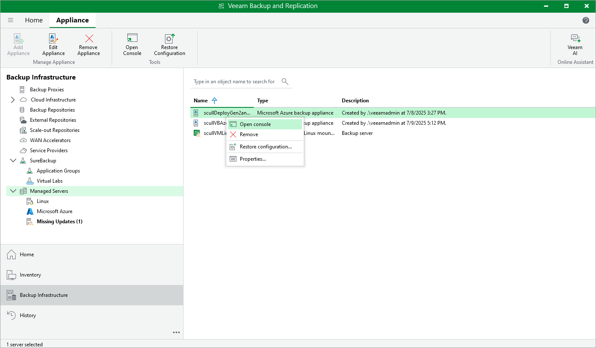

In this article

To access the Veeam Backup for Microsoft Azure Web UI from the Veeam Backup & Replication console, do the following:

1. Open the Backup Infrastructure view.
2. Navigate to Managed Servers.
3. Select the backup appliance whose Web UI you want to open, and click Open Console on the ribbon.

Alternatively, you can right-click the appliance and select Open console.

Veeam Backup & Replication will open the Veeam Backup for Microsoft Azure Web UI in your default web browser.

Page updated 7/9/2025

Page content applies to build 8.0.1.202
