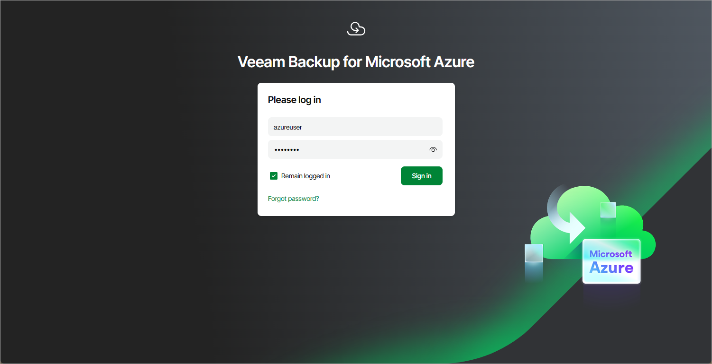
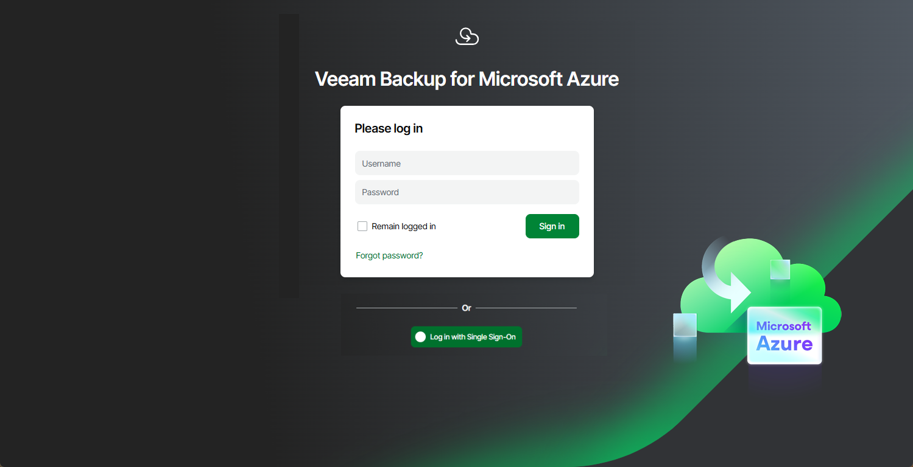

# Accessing Web UI from Workstation

To access Veeam Backup for Microsoft Azure Web UI from a workstation, navigate to the Veeam Backup for Microsoft Azure web address in a web browser. The address consists of a public IPv4 address or DNS hostname of the backup appliance. Note that the website is available over HTTPS only.

|  |
| --- |
| Important |
| Consider the following:   * If you backup appliance is deployed without a public IP address, you must enable the private network deployment functionality for the appliance. For more information, see [Working in Private Environments](app_private_network.md). * Internet Explorer is not supported. To access the Veeam Backup for Microsoft Azure Web UI, use Microsoft Edge (latest version), Mozilla Firefox (latest version) or Google Chrome (latest version). |

You can access Veeam Backup for Microsoft Azure using a local user account or a user account of an external identity provider. To learn how to add user accounts to Veeam Backup for Microsoft Azure, see [Adding User Accounts](user_account_add.md).

|  |
| --- |
| Note |
| The web browser may display a warning notifying that the connection is untrusted. To eliminate the warning, you can replace the TLS certificate that is currently used to secure traffic between the browser and the backup appliance with a trusted TLS certificate. To learn how to replace certificates, see [Replacing Security Certificates](working_with_certificates.md). |

Logging In Using Local User Account

To log in using credentials of a Veeam Backup for Microsoft Azure user account, do the following:

1. In the Username and Password fields, specify credentials of an authorized user account.

If you log in for the first time, use credentials of the Administrator account that was created after the product installation. In future, you can add other user accounts to grant access to Veeam Backup for Microsoft Azure. For more information, see [Managing User Accounts](managing_permissions.md).

|  |
| --- |
| Tip |
| If you do not remember the password, you can reset it. To do that, click the Forgot password? link and follow the instructions provided in [this Veeam KB article](https://www.veeam.com/kb3066). |

1. Select the Remain logged in check box to stay logged in for 24 hours. Otherwise, you will remain logged in for 1 hour.
2. Click Sign in.

If [multi-factor authentication (MFA) is enabled](configuring_mfa_settings.md) for the user, Veeam Backup for Microsoft Azure will prompt you to enter a code to verify the user identity. In the Verification code field, enter the temporary six-digit code generated by the authentication application running on your trusted device. Then, click Sign in.

Logging In Using Identity Provider User Account

|  |
| --- |
| Important |
| To access Veeam Backup for Microsoft Azure under a user account of your identity provider, you must first [configure single sign-on settings](configuring_sso.md) and then [add the identity provider user account](user_account_add.md) to Veeam Backup for Microsoft Azure. |

To log in using an identity provider, do the following:

1. Click Log in with Single Sign-On. You will be redirected to your identity provider portal.
2. If you have not logged in yet, log in to the identity provider portal. You will be redirected to the Veeam Backup for Microsoft Azure Overview page as an authorized user.

Logging Out

To log out, at the top right corner of the Veeam Backup for Microsoft Azure window, click the user name and then click Log Out.

