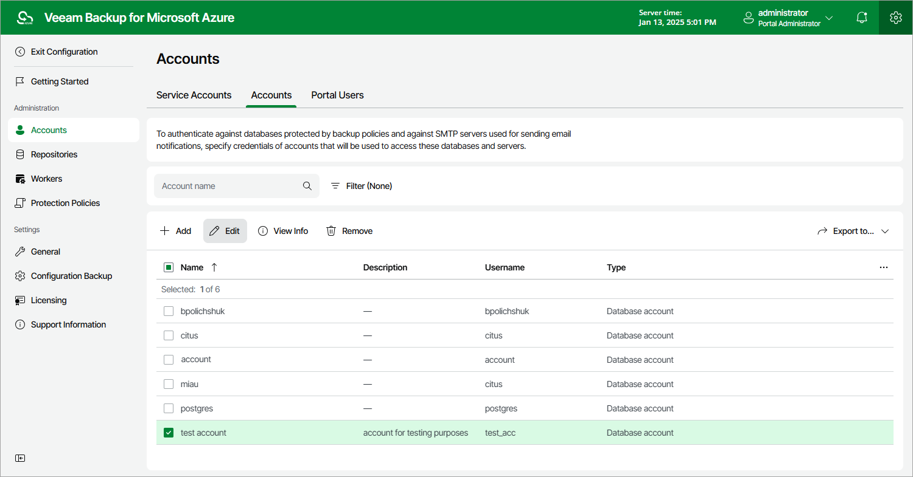

In this article

For each SMTP and database account added to the backup appliance, you can modify the settings of the account:

1. Switch to the Configuration page.

1. Navigate to Accounts > Accounts.

1. Select the account and click Edit.
2. Complete the Edit Account wizard.

1. To specify a new name and description for the account, follow the instructions provided in section [Adding SMTP and Database Accounts](smtp_database_account_name.md) (step 2).
2. To modify credentials of the account, follow the instructions provided in section [Adding SMTP and Database Accounts](smtp_database_account_password.md) (step 3).
3. At the Summary step of the wizard, review summary information and click Finish.

Page updated 6/13/2025

Page content applies to build 8.0.1.202
