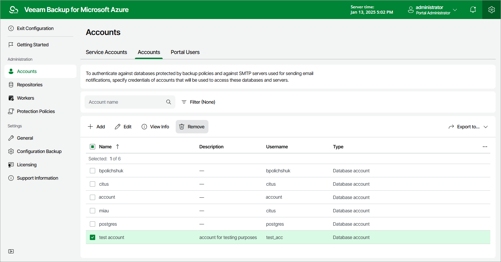

In this article

Veeam Backup for Microsoft Azure allows you to permanently remove an SMTP or database account from the configuration database if you no longer need it:

1. Switch to the Configuration page.
2. Navigate to Accounts > Accounts.
3. Select the account and click Remove.

|  |
| --- |
| Important |
| You cannot remove a database account that is associated with any backup policy. [Modify the settings of all the related policies](backup.md) to remove references to the account — and then try removing the account again. |

Page updated 3/7/2025

Page content applies to build 8.0.1.202
