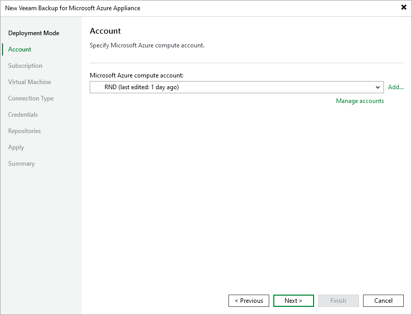

In this article

At the Account step of the wizard, select a Microsoft Azure compute account whose permissions will be used to connect the backup appliance.

For a Microsoft Azure compute account to be displayed in the Microsoft Azure compute account drop-down list, it must be added to the Cloud Credentials Manager as described in the Veeam Backup & Replication User Guide, section [Microsoft Azure Compute Accounts](https://helpcenter.veeam.com/docs/vbr/userguide/restore_azure_acc_name.html?ver=13). If you have not added the necessary credentials to the Cloud Credentials Manager beforehand, you can do it without closing the New Veeam Backup for Microsoft Azure Appliance wizard. To do that, click either the Manage accounts link or the Add button, and complete the Microsoft Azure Compute Account wizard.

For each newly created account, Veeam Backup & Replication creates a new Microsoft Entra application in your Microsoft Entra ID. The application is automatically assigned the Key Vault Crypto User, Owner and Storage Queue Data Contributor [Azure built-in roles](https://learn.microsoft.com/en-us/azure/role-based-access-control/built-in-roles). Note that the Owner role has a wide scope of permissions and capabilities. If you want the application to be assigned a limited list of permissions, create an application [manually in Microsoft Azure](https://learn.microsoft.com/en-us/azure/active-directory/develop/howto-create-service-principal-portal). For more information on the required permissions that must be assigned to the Microsoft Entra application, see [Plug-In Permissions](plugin_permissions.md).

|  |
| --- |
| Important |
| Microsoft Azure Stack Hub accounts are not supported. |

Page updated 8/19/2025

Page content applies to build 8.0.1.202
