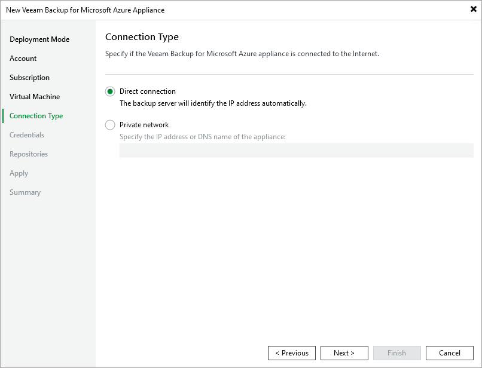

# Step 6. Specify Connection Type

At the Connection Type step of the wizard, specify the way Veeam Backup & Replication will connect to the backup appliance:

* Select the Direct connection option if the backup appliance is connected to a virtual network with inbound internet access allowed and you want the backup server to connect to this appliance over the internet. In this case, Veeam Backup & Replication will detect the public IP address of the appliance automatically.
* Select the Private network option if the backup appliance and the backup server are connected to the same private virtual network, or you want the backup server to connect to the appliance over VPN. In this case, you must specify the private IP address or the DNS hostname of the appliance in the Specify the IP address or DNS name of the appliance field.

