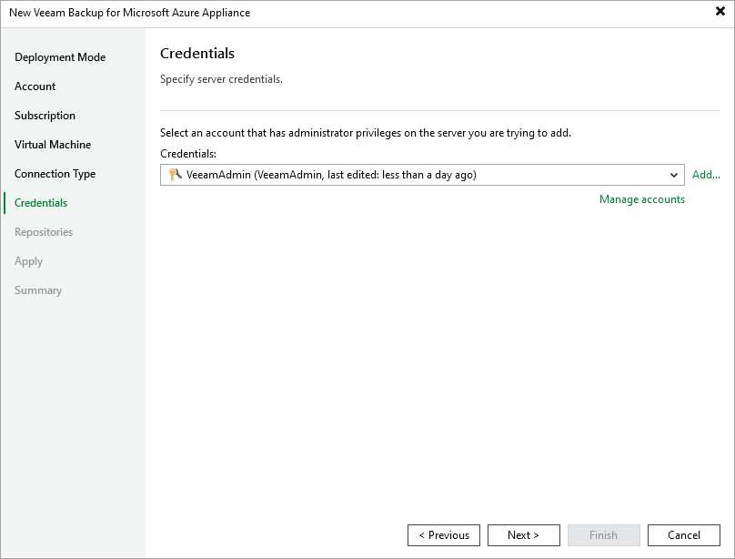

In this article

At the Credentials step of the wizard, specify a user whose credentials Veeam Backup & Replication will use to connect to the backup appliance.

For a user to be displayed in the Credentials list, it must be added to the Credentials Manager as described in the Veeam Backup & Replication User Guide, section [Standard Accounts](https://helpcenter.veeam.com/docs/vbr/userguide/credentials_manager_windows.html?ver=13). If you have not added the necessary user to the Credentials Manager beforehand, you can do it without closing the New Veeam Backup for Microsoft Azure Appliance wizard. To do that, click either the Manage accounts link or the Add button, and specify the user name, password and description in the Credentials window.

|  |
| --- |
| Important |
| The specified user must have multi-factor authentication (MFA) disabled and the Portal Administrator role assigned. |

If you try to add to the backup infrastructure an appliance that runs a version of Veeam Backup for Microsoft Azure that is not compatible with the version of Veeam Backup & Replication, Veeam Backup & Replication will display a warning notifying that the appliance must be upgraded. To eliminate the warning, click Yes. Veeam Backup & Replication will automatically upgrade the appliance to the necessary version. Note that the Microsoft Azure compute account specified at [step 3](adding_appliance_account.md) must have permissions required to upgrade the appliance. For more information, see [Plug-In Permissions](plugin_permissions.md).

When you add a backup appliance to the backup infrastructure, Veeam Backup & Replication automatically verifies the TLS certificate installed on the appliance:

* If the certificate is trusted, Veeam Backup & Replication saves a thumbprint of the certificate in the configuration database. When Veeam Backup & Replication connects to the appliance, it uses the saved thumbprint to verify the appliance identity and to avoid the man-in-the-middle attack.
* If the certificate is not trusted, Veeam Backup & Replication does not save a thumbprint of the certificate in the configuration database. When Veeam Backup & Replication connects to the appliance, the appliance is shown in the Veeam Backup & Replication console as unavailable.

|  |
| --- |
| Important |
| * Do not change the role of a Veeam Backup for Microsoft Azure user whose credentials are used by Veeam Backup & Replication to connect to the backup appliance. * If you change the password of a Veeam Backup for Microsoft Azure user whose credentials are used by Veeam Backup & Replication to connect to the backup appliance, you must also change this user password in the Veeam Backup & Replication console as described in the Veeam Backup & Replication User Guide, section [Editing and Deleting Credentials Records](https://helpcenter.veeam.com/docs/vbr/userguide/credentials_edit_delete.html?ver=13). Otherwise, the connection will not be established. |

Page updated 8/20/2025

Page content applies to build 8.0.1.202
