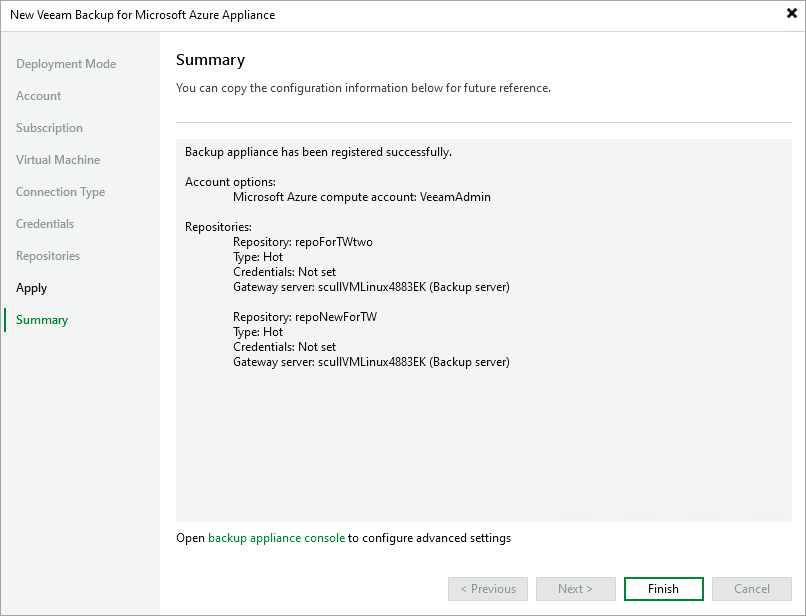

# Step 10. Finish Working with Wizard

At the Summary step of the wizard, review summary information and click Finish.

After the backup appliance is added to the infrastructure, you can configure its settings in the Veeam Backup for Microsoft Azure Web UI as described in section [Configuring Veeam Backup for Microsoft Azure](configuration.md). If you want Veeam Backup & Replication to open the Web UI of the added appliance immediately, click the backup appliance console link.

