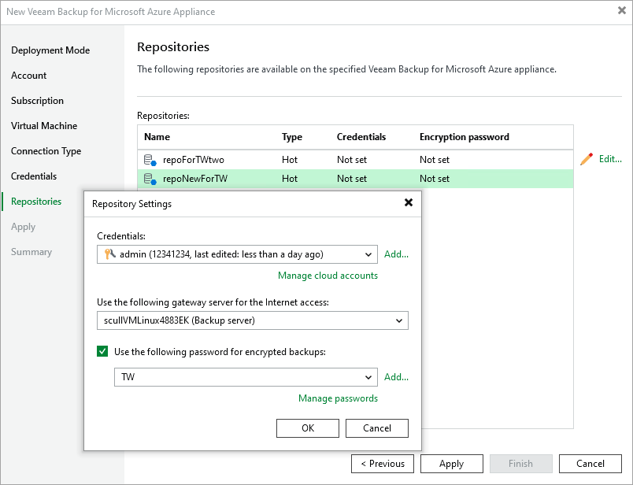

In this article

The Repositories step of the wizard, a list of all standard and archive repositories already configured on the selected backup appliance will be displayed. After you complete the wizard, Veeam Backup & Replication will automatically add these repositories to the backup infrastructure.

You can specify the following configuration settings for each repository whose restore points you want to use to recover backed-up data:

|  |
| --- |
| Note |
| The following procedure applies only to standard repositories. For archive repositories, there is no possibility to specify any configuration settings. |

1. In the Repositories list, select the necessary standard repository and click Edit.
2. In the Repository Settings window:

1. From the Credentials drop-down list, select credentials of a Microsoft Azure storage account where the target blob container resides. Veeam Backup & Replication will use these credentials to access the repository. For more information on supported types of storage accounts, see the Veeam Backup & Replication User Guide, section [Cloud Credentials Manager](https://helpcenter.veeam.com/docs/vbr/userguide/cloud_credentials_azure_storage.html?ver=13).

For credentials to be displayed in the list of available credentials, they must be added to the Cloud Credentials Manager as described in the Veeam Backup & Replication User Guide, section [Microsoft Azure Storage Accounts (Shared Key)](https://helpcenter.veeam.com/docs/vbr/userguide/cloud_credentials_azure_storage.html?ver=13). If you have not added the necessary credentials to the Cloud Credentials Manager beforehand, you can do it without closing the New Veeam Backup for Microsoft Azure Appliance wizard. To do that, click either the Manage cloud accounts link or the Add button, and specify the storage account name and access key generated for the account in the Credentials window.

|  |
| --- |
| Note |
| If you do not specify credentials of the Microsoft Azure storage account for a standard repository, you will only be able to use the Veeam Backup & Replication console to perform [entire VM restore](entire_vm_restore_console.md), [SQL database restore](sql_restore_console.md) and [Cosmos DB restore](cosmos_db_restore_console.md) from backups stored in this repository. Moreover, encrypted backups will be displayed as non-encrypted ones, and information on the repository displayed in the Backup Infrastructure view under the External Repositories node will not include statistics on the amount of storage space that is currently consumed by restore points created by Veeam Backup for Microsoft Azure. |

1. From the Use the following gateway server for the Internet access drop-down list, select a gateway server that will be used to provide access to the repository.

For a gateway server to be displayed in the Use the following gateway server for the Internet access drop-down list, it must be added to the backup infrastructure. For more information on gateway servers, see [Gateway Servers](gateway_servers.md).

1. If encryption is enabled for the repository, the following scenarios may apply:

* If data in the repository is encrypted using a password, select the Use the following password for encrypted backups check box. From the drop-down list, select the password that is used to encrypt data. Veeam Backup & Replication will use the specified password to decrypt backup files stored in this repository.

For a password to be displayed in the Use the following password for encrypted backups drop-down list, it must be added to the backup infrastructure as described in the Veeam Backup & Replication User Guide, section [Creating Passwords](https://helpcenter.veeam.com/docs/vbr/userguide/password_manager_create.html?ver=13). If you have not added the necessary password beforehand, you can do it without closing the Repository Settings window. To do that, click either the Manage cloud accounts link or the Add button, and specify the password and hint in the Password window.

|  |
| --- |
| Note |
| If you do not specify a password for a standard repository with encryption enabled, you will have to decrypt data stored in this repository manually as described in section [Managing Backed-Up Data Using Console](managing_backups_console.md#decrypt_image_level_backups). |

* If data in the standard repository is encrypted with an Azure Key Vault cryptographic key, Veeam Backup & Replication will show the used key in the Perform Azure encryption with the following key drop-down list, but will not allow you change it.

After you finish working with the wizard, all the added repositories will be displayed in the Backup Infrastructure view under the External Repositories node.

|  |
| --- |
| Notes |
| * If some of the repositories are already added to the backup infrastructure of another backup server, you will be prompted to claim the ownership of these repositories. To learn how to claim the ownership, see the Veeam Backup & Replication User Guide, section [Ownership](https://helpcenter.veeam.com/docs/vbr/userguide/external_repository_ownership.html?ver=13). * Veeam Backup & Replication stores information on all external repositories in the same database. That is why, if you have already connected to an existing appliance and if repositories that are added to this appliance have the same names as the repositories whose settings are currently being configured, Veeam Backup & Replication will not be able to fully use these repositories as storage locations. To resolve the issue, rename the repositories as described in section [Editing Repository Settings](repository_edit.md). |

Related Topics

[Managing Backed-Up Data Using Console](managing_backups_console.md)

Page updated 9/16/2025

Page content applies to build 8.0.1.202
