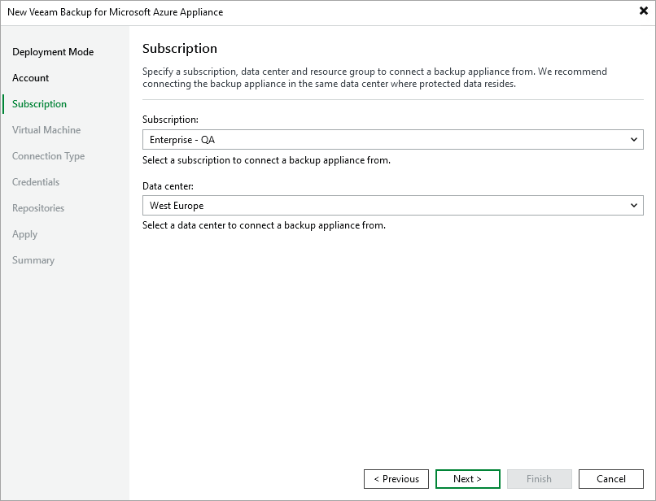

In this article

At the Subscription step of the wizard, do the following:

1. From the Subscription drop-down list, select an Azure subscription that is used to manage costs of the backup appliance.

For a subscription to be displayed in the list of available subscriptions, it must be [created in Microsoft Azure](https://learn.microsoft.com/en-us/azure/cost-management-billing/manage/create-subscription) and [associated with the Microsoft Entra tenant](https://docs.microsoft.com/en-us/azure/active-directory/fundamentals/active-directory-how-subscriptions-associated-directory) to which the Microsoft Azure compute account specified at [step 3](adding_appliance_account.md) belongs.

1. From the Data center drop-down list, select the Azure region in which the backup appliance resides.

For more information on regions and zones, see [Microsoft Docs](https://learn.microsoft.com/en-us/azure/virtual-machines/regions).

Page updated 8/5/2025

Page content applies to build 8.0.1.202
