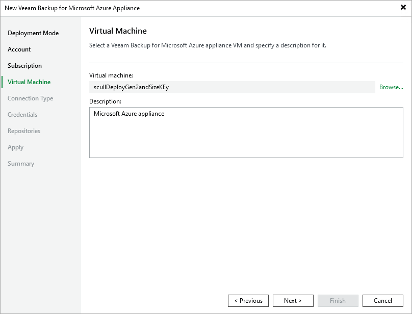

# Step 5. Select Appliance

At the Virtual Machine step of the wizard, choose the Azure VM running the backup appliance and provide a description for future reference. For the VM to be displayed in the list of available VMs, it must belong to the Azure subscription specified at [step 4](adding_appliance_subscription.md).

