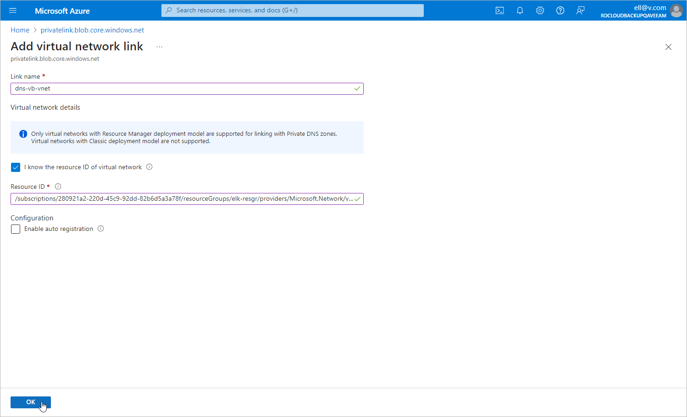

In this article

[This step applies only if you chose to create and manage the private DNS zones manually at [step 1](app_pne_dns_zones.md)]

To allow Veeam Backup for Microsoft Azure to perform backup operations in the private environment, you must add the VNet to which the backup appliance is connected and the VNet selected for the worker configuration created at [step 2](app_pne_worker_configuration.md) to both DNS zones created at [step 1](app_pne_dns_zones.md).

To add a VNet to a DNS zone, do the following:

1. Log in to the [Microsoft Azure portal](https://portal.azure.com).
2. Open the Resource group page.
3. In the Resource list, locate and click the necessary VNet. The Virtual network page will open.
4. Navigate to JSON view. In the Resource JSON window, navigate to the Resource ID field and copy the ID to the clipboard.
5. Back to the Resource group page, in the Resource list, locate the private DNS zones created at [step 1](app_pne_dns_zones.md) and click one of them.
6. On the Private DNS zone page, navigate to Settings > Virtual network links and click Add.
7. In the Add virtual network link window, create a link to the VNet:

1. In the Link name field, specify a name for the link.
2. In the Virtual network details section, select the I know the resource ID of virtual network check box.
3. In the Resource ID field, paste the ID of the VNet.
4. Click OK.

Page updated 5/7/2025

Page content applies to build 8.0.1.202
