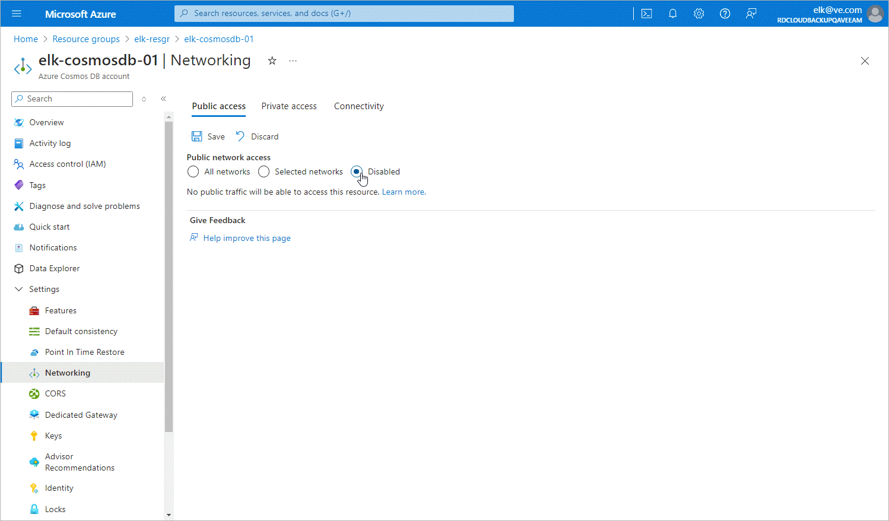

# Configuring Networking Settings for Cosmos DB Accounts

To allow Veeam Backup for Microsoft Azure to back up a Cosmos DB account in a private environment, you must disable public access to this account:

1. Log in to the [Microsoft Azure portal](https://portal.azure.com).
2. Click More services and select Resource groups on the All services page.
3. On the Resource groups page, select the resource group to which the necessary Cosmos DB account belongs. The resource group page will open.
4. In the Resource list, locate and click the Cosmos DB account that you want to protect. The Azure Cosmos DB account page will open.
5. Navigate to Settings > Networking.
6. In the Public access tab, navigate to Public network access and select the Disabled option.

Backup to Repository

If you enable backup to a repository, you must perform the following steps:

1. [Disable public access to the Cosmos DB for PostgreSQL account](pne_cosmos_db_disable_public_access.md).
2. [Create private endpoints for the Cosmos DB for PostgreSQL account](pne_cosmos_db_endpoints.md).
3. [Configure network settings for the private endpoints](pne_cosmos_db_endpoints_vnet_links.md).

