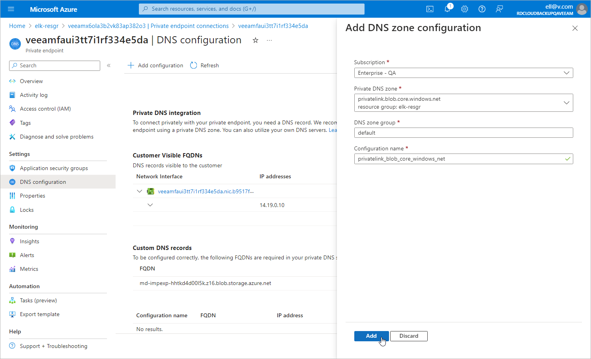

In this article

[This step applies only if you chose to create and manage the private DNS zones manually at [step 1](app_pne_dns_zones.md)]

To allow worker instances to export the snapshot to the repository in the private environment, you must add the private endpoints of the disk access resources that Veeam Backup for Microsoft Azure automatically created at [step 7](app_pne_second_policy_run.md) to the privatelink.blob.core.windows.net DNS zone created at [step 1](app_pne_dns_zones.md). To do that:

1. Log in to the [Microsoft Azure portal](https://portal.azure.com).
2. Open the Resource group page.
3. In the Resource list, search for disk access resources that reside in the same region as your backup appliance and are assigned the Veeam backup appliance ID tag.
4. Click the necessary disk access resource. The Disk Access page will open.
5. Switch to the Private endpoint connections tab and locate the private endpoint created for disk access. To do that, click the link in the Private endpoint column. The private endpoint for disk access will have the disks value set in the Target sub-resource field.
6. Navigate to DNS configuration and click Add configuration.
7. In the Add DNS zone configuration window, do the following:

1. From the Subscription drop-down list, select the subscription where the DNS zones created at [step 1](app_pne_dns_zones.md) reside.
2. From the Private DNS zone drop-down list, select the pair of the privatelink.blob.core.windows.net name and the resource group in which the DNS zone was created. Leave the default settings for the other options in this window.
3. Click Add.

1. In the DNS zone, create an 'A' record for the added private endpoint as described in [Microsoft Docs](https://learn.microsoft.com/en-us/azure/dns/dns-getstarted-portal#create-a-dns-record).

Page updated 8/20/2025

Page content applies to build 8.0.1.202
