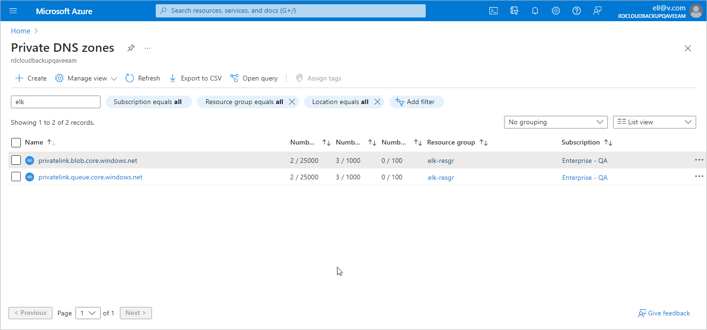

# Step 1. Create Private DNS Zones

To create and manage Azure private DNS zones that will allow Veeam Backup for Microsoft Azure to operate in your private environment, do either of the following:

* If you want to create and manage the DNS zones manually, log in to the [Microsoft Azure portal](https://portal.azure.com) and create two Azure private DNS zones named privatelink.blob.core.windows.net and privatelink.queue.core.windows.net as described in [Microsoft Docs](https://learn.microsoft.com/en-us/azure/dns/private-dns-getstarted-portal). It is recommended that you create the DNS zones in the same resource group where the backup appliance resides, to simplify resource management.
* If you want to instruct Veeam Backup for Microsoft Azure to create and manage the DNS zones automatically, send the HTTP PUT request to the /api/v8/system/privateDeployment/state endpoint with the ManageAutomatically value selected for the privateDnsZoneSetting parameter, as described in the Veeam Backup for Microsoft Azure REST API Reference, section [System](https://helpcenter.veeam.com/references/vbazure/8.1/rest/main/tag/System#operation/System_PrivateDeployment_Set). The DNS zones will be created in the resource group to which the worker instances belong.

|  |
| --- |
| Important |
| * If you create the DNS zones manually, make sure that the names of the created private DNS zones are unique within the resource group in which they reside. * If you instruct Veeam Backup for Microsoft Azure to create the DNS zones automatically, keep in mind that Veeam Backup for Microsoft Azure also adds 'A' DNS records to these zones, to ensure connection between infrastructure components. Do not remove these records manually — otherwise, Veeam Backup for Microsoft Azure will not be able to restore them and will fail to operate in a private environment. For more information on DNS records, see [Microsoft Docs](https://learn.microsoft.com/en-us/azure/dns/dns-zones-records#dns-records). |

