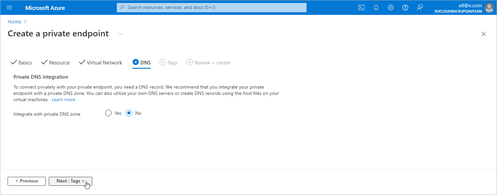

# Step 8e. Specify DNS Settings

At the DNS step of the Create a private endpoint wizard, do the following:

1. In the Private DNS integration section, navigate to the Integrate with private DNS zone field and click No.

1. Click Next: Tags >.

