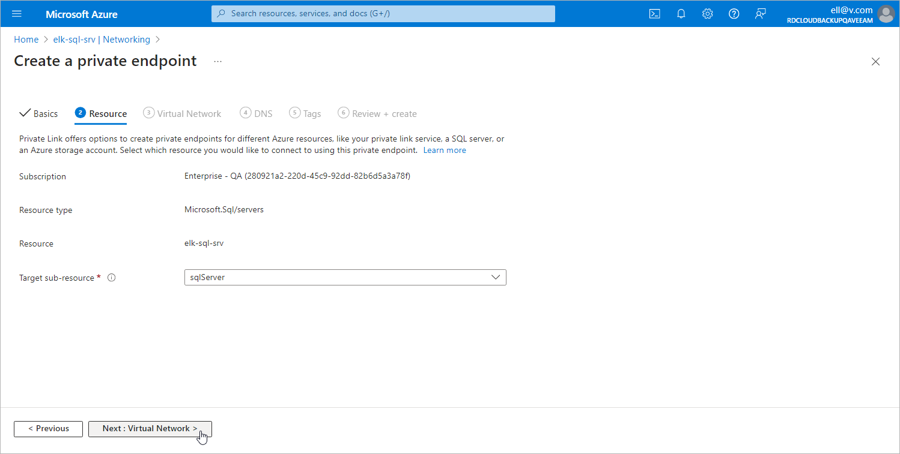

In this article

At the Resource step of the Create a private endpoint wizard, do the following:

1. From the Subscription drop-down list, select an Azure subscription to which a SQL Server that you want to protect belongs.
2. From the Resource type drop-down list, select the Microsoft.Sql/servers type.
3. From the Resource drop-down list, select the SQL Server that you want to protect.

|  |
| --- |
| Important |
| If you plan to back up SQL databases using a staging server, you must select the SQL Server that will be used as a staging one. To learn how to use staging servers, see [Performing Backup](sql_processing_options.md#staging_server). |

1. From the Target sub-resource drop-down list, select sqlServer.
2. Click Next: Virtual Network >.

Page updated 6/27/2024

Page content applies to build 8.0.1.202
