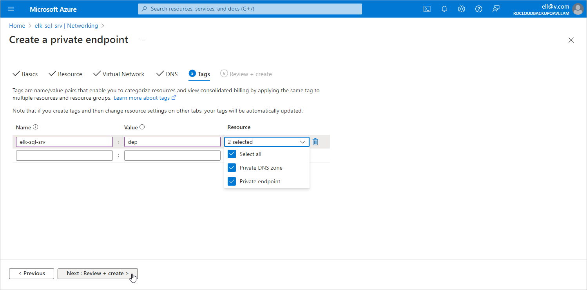

In this article

At the Targets step of the Create a private endpoint wizard, you can assign tags to the newly created private endpoint and private DNS zone if needed.

Page updated 4/29/2024

Page content applies to build 8.0.1.202
