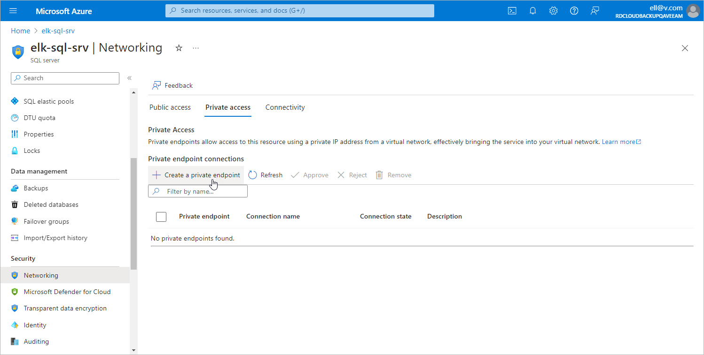

# Step 8a. Launch Create a Private Endpoint Wizard

To launch the Create a private endpoint wizard for a SQL Server for which you want to create a private endpoint, do the following:

1. Log in to the [Microsoft Azure portal](https://portal.azure.com).
2. Click More services and select Resource groups on the All services page.
3. On the Resource groups page, select the resource group to which the necessary SQL Server belongs. The resource group page will open.
4. In the Resource list, locate and click the SQL Server that you want to protect. The SQL server page will open.
5. Navigate to Security > Networking.
6. Switch to the Private access tab and click Create a private endpoint.

