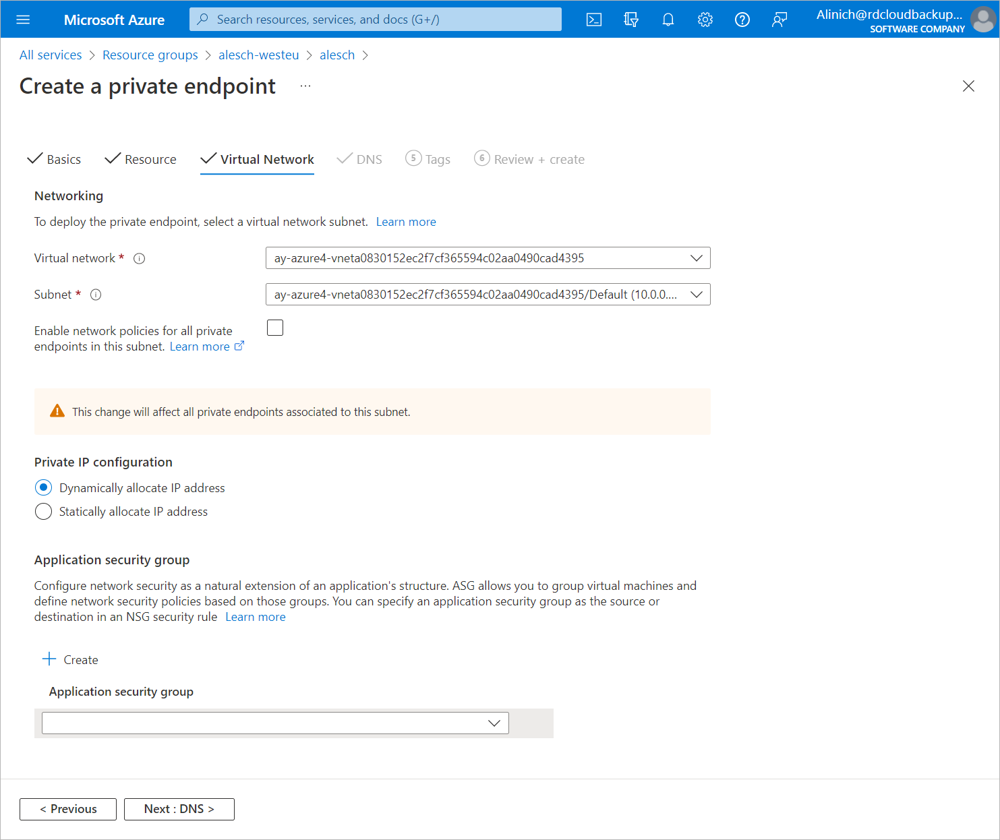

In this article

At the Virtual Network step of the Create a private endpoint wizard, do the following:

1. From the Virtual network drop-down list, select a virtual network to which the backup appliance or worker instances are connected.
2. From the Subnet drop-down list, select a subnet to which the backup appliance or worker instances are connected. For a subnet to be displayed in the list, it must be created within the selected virtual network as described in [Microsoft Docs](https://docs.microsoft.com/en-us/azure/virtual-network/virtual-network-manage-subnet).

1. Click Next: DNS >.

Page updated 1/12/2024

Page content applies to build 8.0.1.202
