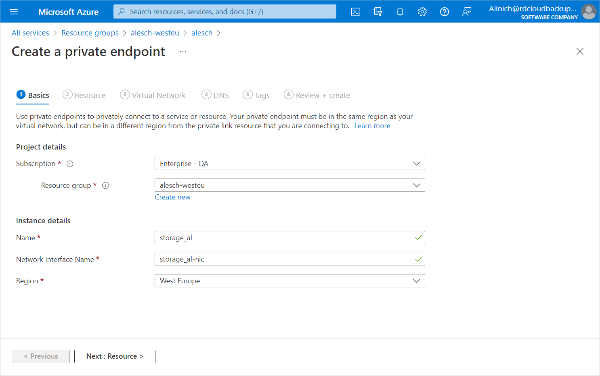

In this article

At the Basics step of the Create a private endpoint wizard, do the following:

1. From the Subscription drop-down list, select an Azure subscription to which your virtual network belongs.
2. From the Resource group drop-down list, select a resource group to which your newly created private endpoint will belong. You can either use an existing resource group or create a new one. For more information on creating and managing resource groups, see [Microsoft Docs](https://docs.microsoft.com/en-us/azure/azure-resource-manager/management/manage-resource-groups-portal).
3. In the Name field, enter a name for the private endpoint.
4. From the Region drop-down list, select an Azure region of the virtual network to which the backup appliance or worker instances are connected.

For more information on the Azure regions, see [Microsoft Docs](https://docs.microsoft.com/en-us/azure/virtual-machines/windows/regions).

1. Click Next: Resource >.

Page updated 8/26/2024

Page content applies to build 8.0.1.202
