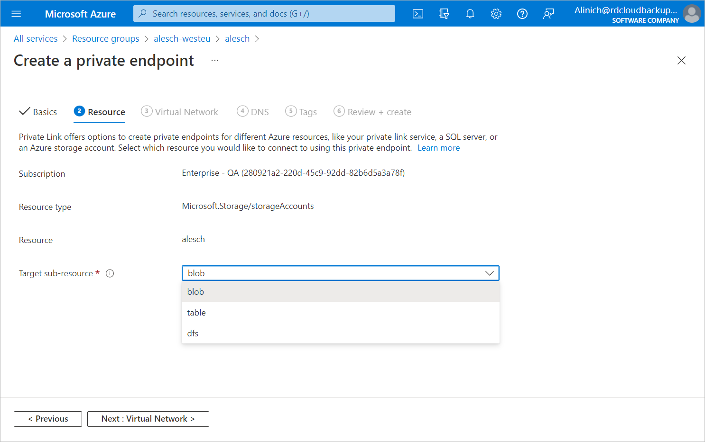

In this article

At the Resource step of the Create a private endpoint wizard, do the following:

1. From the Target sub-resource drop-down list, select the type of the resource:

* Select blob if you are creating a private endpoint to allow Veeam Backup for Microsoft Azure to manage backup repositories or back up Azure VMs.
* Select file if you are creating a private endpoint to allow Veeam Backup for Microsoft Azure to back up Azure file shares.

1. Click Next: Virtual Network >.

Page updated 9/19/2024

Page content applies to build 8.0.1.202
