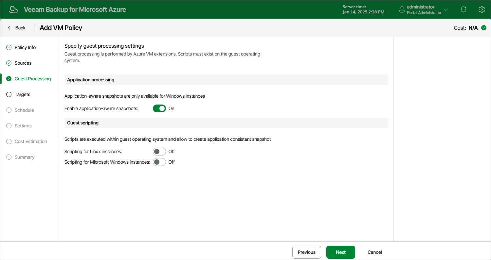

# Enabling Application-Aware Processing

Veeam Backup for Microsoft Azure takes transactionally consistent VM snapshots while no write operations occur on VM disks — to do that, it quiesces applications on the processed VMs and creates a consistent view of application data.

To enable application-aware processing, set the Enable application aware snapshots toggle to On.

|  |
| --- |
| Important |
| To create application-aware snapshots, the VSS Guest Agent uses the VSS Copy Backup technology that does not support truncation of transaction logs. For more information on VSS backup, see [Microsoft Docs](https://docs.microsoft.com/en-us/windows/win32/vss/vss-backup-state). |

Considerations and Limitations

To enable application-aware processing, VSS agents must be installed on source Azure VMs. To install VSS agents, Veeam Backup for Microsoft Azure runs a specific PowerShell script on the source Azure VMs. That is why if you use PowerShell execution policies to control the conditions under which PowerShell loads configuration files and runs scripts on your source VMs, make sure that the LocalMachine scope is set to the RemoteSigned value. Otherwise, Veeam Backup for Microsoft Azure will not be able to run the script and application-aware processing will fail.

