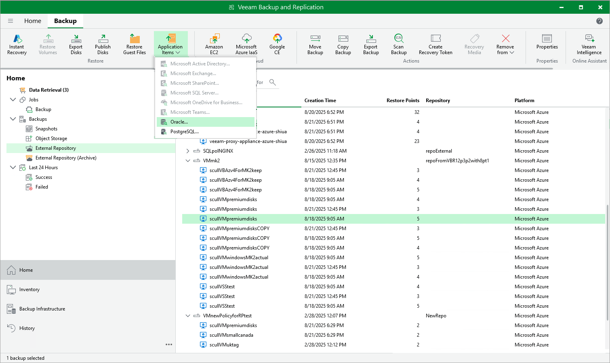

# Performing Application Item Restore

Veeam Backup & Replication provides auxiliary tools — Veeam Explorers — that allow you to restore application items directly from image-level backups of Azure VMs. For more information on Veeam Explorers, see the [Veeam Explorers User Guide](https://helpcenter.veeam.com/docs/vbr/explorers/explorers_introduction.html?ver=13).

|  |
| --- |
| Important |
| Application restore cannot be performed using backups that are stored in [Veeam Data Cloud storage vaults](vdc_vaults.md). To perform this operation, use backups that are stored in standard backup repositories for which you have specified Microsoft Azure storage account credentials. To learn how to specify credentials for repositories, see sections [Creating New Repositories](repository_console_storage_account.md) and [Connecting to Existing Appliances](adding_appliance_repository.md). |

You can restore items of the following applications:

* Microsoft Active Directory
* Microsoft Exchange
* Microsoft SharePoint
* Microsoft SQL Server
* Oracle Database
* PostgreSQL Database

To perform application restore, do the following:

1. In the Veeam Backup & Replication console, open the Home view.
2. Navigate to Backups > External Repository.
3. Expand the backup policy that protects an Azure VM whose application item you want to restore, select the necessary VM and click Application Items on the ribbon. Then, select the necessary application.
4. In the restore wizard, select a restore point that will be used to restore the application, specify a restore reason and click Browse.
5. In the Veeam Explorer application, perform the steps described in the [Veeam Explorers User Guide](https://helpcenter.veeam.com/docs/backup/explorers/explorers_introduction.html?ver=120).

|  |
| --- |
| Important |
| The backup from which you want to restore application items must be transactionally consistent. To learn how to create transactionally consistent backups, see section [Creating Backup Policies](application_aware_processing.md). |

