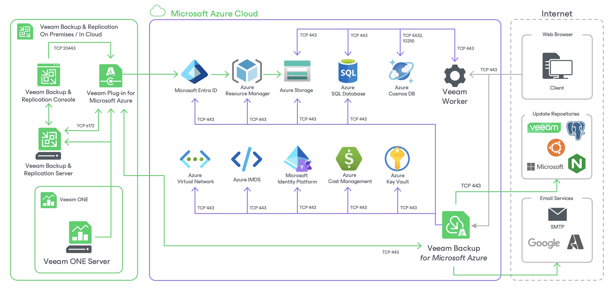

In this article

The Veeam Backup for Microsoft Azure architecture includes the following components:

* [Backup server](backup_server.md)
* [Veeam Plug-in for Microsoft Azure](plug_in.md)
* [Backup appliances](backup_appliances.md)
* [Backup repositories](backup_repositories.md)
* [Veeam Data Cloud storage vaults](vdc_vaults.md)
* [Worker instances](worker_instances.md)
* [Additional repositories and tape devices](additional_repositories_and_tape_devices.md)
* [Gateway servers](gateway_servers.md)

Page updated 12/9/2025

Page content applies to build 8.0.1.202
