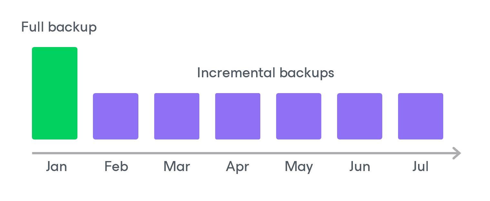

In this article

If you enable backup archiving for a backup policy, Veeam Backup for Microsoft Azure creates a new backup in an archive repository during every archive session. A sequence of backups created during a set of archive sessions makes up an archive backup chain.

The archive backup chain includes backups of the following types:

* Full — a full archive backup stores a copy of the full Azure VM image.
* Incremental — incremental archive backups store incremental changes of the Azure VM image.

To create an archive backup chain for an Azure VM protected by a backup policy, Veeam Backup for Microsoft Azure implements the forever forward incremental backup method:

1. During the first archive session, Veeam Backup for Microsoft Azure detects backed-up data that is stored in the full backup and all incremental backups existing in the [backup chain](backup_chain_vm.md), creates a full archive backup with all the data, and copies this backup to the archive repository. The full archive backup becomes a starting point in the archive chain.
2. During subsequent archive sessions, Veeam Backup for Microsoft Azure checks the backup chain to detect data blocks that have changed since the previous archive session, creates incremental archive backups with only those changed blocks, and copies these backups to the archive repository. The content of each incremental archive backup depends on the content of the full archive backup and the preceding incremental archive backups in the archive backup chain.

Full and incremental archive backups act as restore points for backed-up Azure VMs that let you roll back your data to the necessary state. To recover an Azure VM to a specific point in time, the chain of backups created for the VM must contain a full archive backup and a set of incremental archive backups.

If some backup in the archive backup chain is missing, you will not be able to roll back to the necessary state. For this reason, you must not delete individual backups from the archive repository manually. Instead, you must specify retention policy settings that will let you maintain the necessary number of backups in the archive repository. For more information, see [Retention Policy for Archived Backups](vm_archive_backup_retention.md).

Page updated 12/9/2025

Page content applies to build 8.0.1.202
