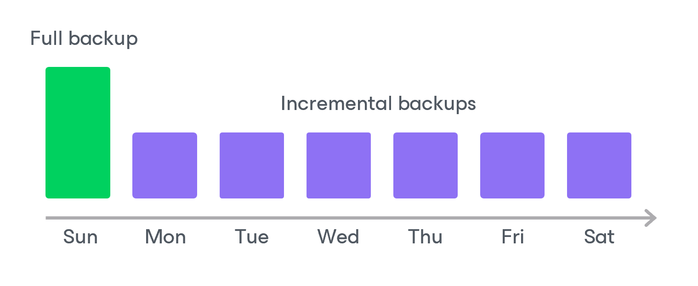

# Backup Chain

During every backup session, Veeam Backup for Microsoft Azure creates a new backup for each Azure SQL database added to a backup policy. A sequence of backups created during a set of backup sessions makes up a backup chain.

The backup chain includes backups of the following types:

* Full — a full backup stores a copy of the full Azure SQL database image.
* Incremental — incremental backups store incremental changes of the Azure SQL database images.

To create a backup chain for an Azure SQL database protected by a backup policy, Veeam Backup for Microsoft Azure implements the forever forward incremental backup method:

1. During the first backup session, Veeam Backup for Microsoft Azure copies the full Azure SQL database and creates a full backup in a backup repository. The full backup becomes a starting point in the backup chain.
2. During subsequent backup sessions, Veeam Backup for Microsoft Azure copies only those data blocks that have changed since the previous backup session and stores these data blocks to incremental backups in the backup repository. The content of each incremental backup depends on the content of the full backup and the preceding incremental backups in the backup chain.

|  |
| --- |
| Note |
| The [changed block tracking (CBT)](changed_block_tracking.md) mechanism is not implemented for Azure SQL databases — during every incremental backup session, Veeam Backup for Microsoft Azure reads only the full Azure SQL database. |

Full and incremental backups act as restore points for backed-up Azure SQL databases that let you roll back your data to the necessary state. To recover an Azure SQL database to a specific point in time, the chain of backups created for the database must contain a full backup and a set of incremental backups dependent on the full backup.

If some backup in the backup chain is missing, you will not be able to roll back to the necessary state. For this reason, you must not delete individual backups from the backup repository manually. Instead, you must specify retention policy settings that will let you maintain the necessary number of backups in the backup repository. For more information, see [SQL Backup Retention](sql_backup_retention.md).

Related Topics

[Archive Backup Chain](archive_chain_sql.md)

