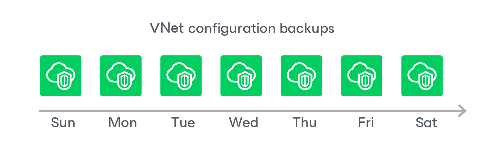

In this article

During every backup session, Veeam Backup for Microsoft Azure creates a restore point with backed-up virtual network configuration data for each Azure subscription protected by the Virtual Network Configuration Backup policy. The restore point contains metadata that includes information on the date and time when the policy ran, Azure subscriptions whose virtual network configuration settings were backed up by the policy, and Microsoft Entra tenants whose service accounts were used to collect virtual network configuration settings for each Azure subscription.

A sequence of restore points created during a set of backup sessions makes up a virtual network configuration backup chain for each configuration record.

You cannot delete specific restore points created for a configuration record — these points are removed automatically according to the specified [retention policy settings](vnet_backup_retention.md). However, you can manually remove a configuration record with all restore points created for it, as described in section [Removing Virtual Network Configuration Backups](removing_vnet_backups.md).

Related Topics

[Virtual Network Configuration Backup Retention](retention_backup_vnet.md)

Page updated 12/9/2025

Page content applies to build 8.0.1.202
