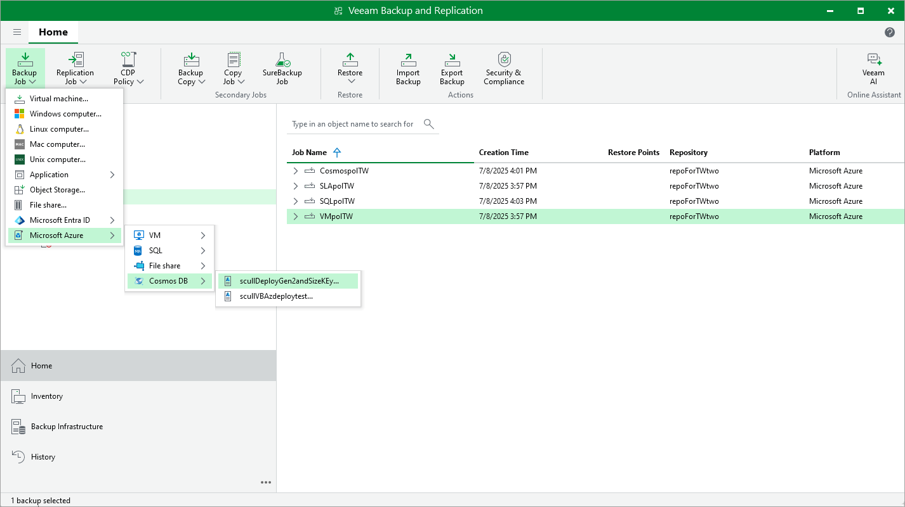

In this article

You can create backup policies in the Veeam Backup for Microsoft Azure Web UI only. However, you can launch the Add Policy wizard directly from the Veeam Backup & Replication console — to do that, use either of the following options:

* Switch to the Home tab, click Backup Job on the ribbon, navigate to Microsoft Azure > VM, SQL, File share or Cosmos DB, and select the backup appliance on which you want to create the backup policy.
* Open the Home view, right-click Jobs, navigate to Backup > Microsoft Azure > VM, SQL, File share or Cosmos DB, and select the backup appliance on which you want to create the backup policy.

Veeam Backup & Replication will open the Add VM Policy, Add Azure SQL Policy, Add Azure Files Policy or Add Cosmos DB Policy wizard in a web browser. Complete the wizard as described in sections [Creating VM Backup Policies](vm_backup_name.md), [Creating SQL Backup Policies](sql_backup_name.md), [Creating Azure Files Backup Policies](fs_backup_name.md) or [Creating Cosmos DB Backup Policies](cosmos_db_backup_name.md).

Page updated 7/11/2025

Page content applies to build 8.0.1.202
