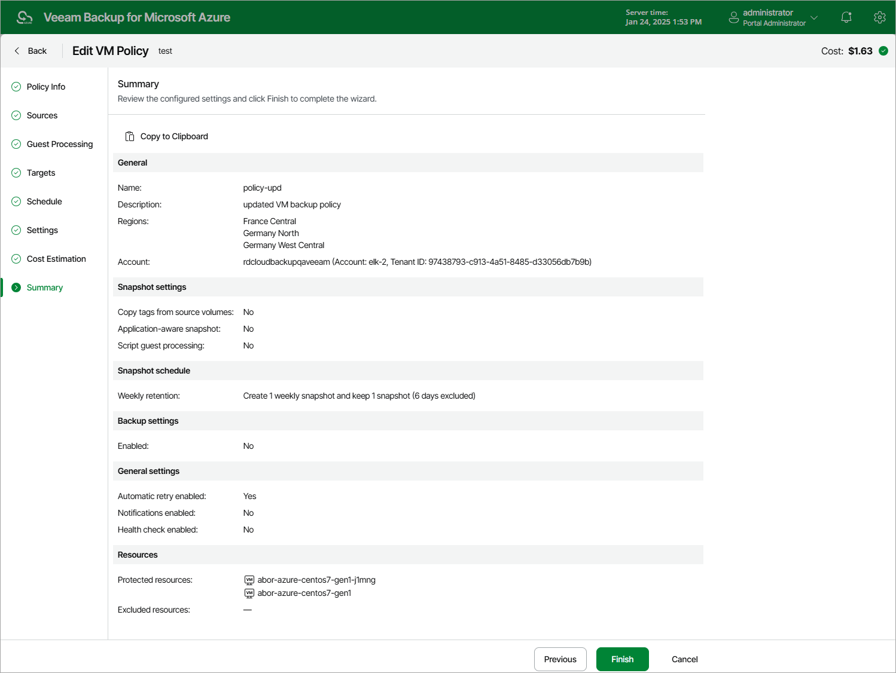

# Editing Backup Policy Settings

For each backup policy, you can modify settings configured while creating the policy:

1. Navigate to Policies.
2. Switch to the necessary tab and select the backup policy.
3. Click Edit.

1. Edit the backup policy settings as described in section [Performing VM Backup](vm_backup_create.md), [Performing SQL Backup](sql_backup_create.md), [Performing Cosmos DB Backup](performing_cosmos_db_backup.md), [Performing Azure Files Backup](fs_backup_create.md) or [Performing Virtual Network Configuration Backup](performing_vnet_backup.md).

|  |
| --- |
| Important |
| * Assigning another SLA template may cause Veeam Backup for Microsoft Azure to incorrectly calculate the SLA compliance ratio for the policy on the day when this modification is made. For more information on how Veeam Backup for Microsoft Azure estimates SLA compliance, see [Viewing SLA-Based Backup Policy Details](sla_calculation.md). * Assigning another storage template will cause Veeam Backup for Microsoft Azure to start a new chain of restore points in the specified location. The old chain of restore points will be retained in the previous location until removed according to retention settings specified for the SLA template assigned to this SLA-based backup policy. |

