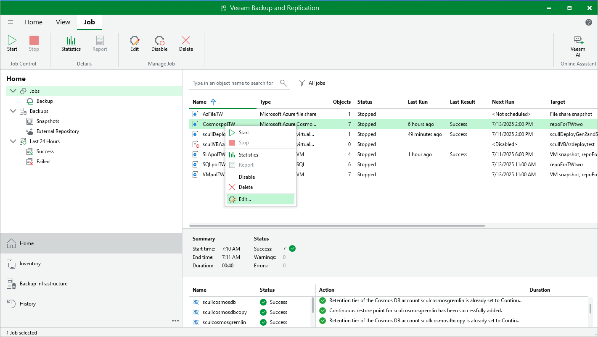

# Editing Backup Policy Settings

You can edit backup policy settings only in the Veeam Backup for Microsoft Azure Web UI. However, you can launch the edit policy wizard directly from the Veeam Backup & Replication console. To do that, do the following:

1. In the Veeam Backup & Replication console, open the Home view.
2. Navigate to Jobs.
3. Select the necessary backup policy and click Edit on the ribbon.

Alternatively, you can right-click the policy and select Edit.

Veeam Backup & Replication will open the Edit Policy wizard in a web browser. Complete the wizard as described in section [Creating VM Backup Policies](vm_backup_create.md), [Creating SQL Backup Policies](sql_backup_create.md), [Creating Azure Files Backup Policies](fs_backup_create.md) or [Editing Virtual Network Configuration Backup Policy](vnet_backup_edit.md).

