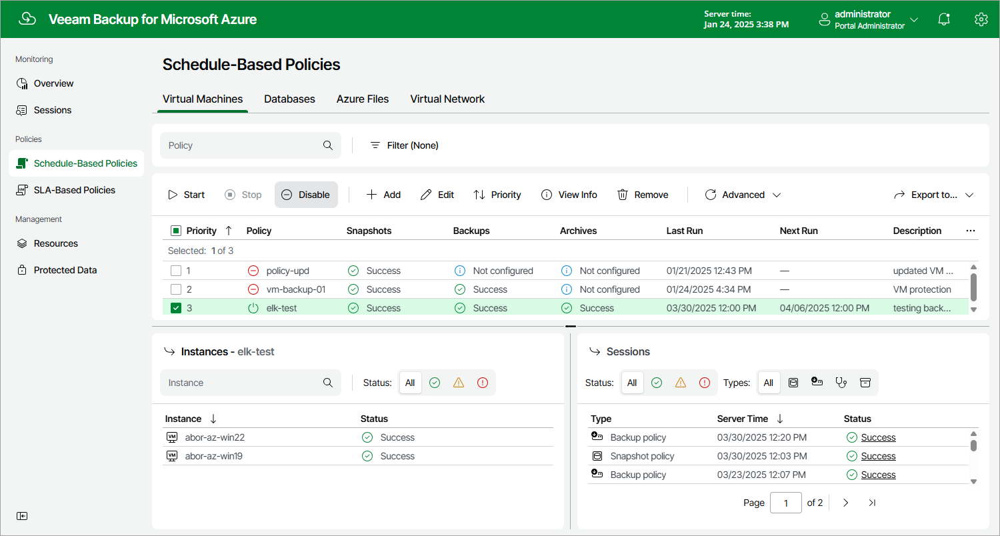

In this article

By default, Veeam Backup for Microsoft Azure runs all created backup policies according to the specified schedules. However, you can temporarily disable a backup policy so that Veeam Backup for Microsoft Azure does not run the backup policy automatically. You will still be able to [manually start](backup_policy_start_stop.md) or enable the disabled backup policy at any time you need.

To enable or disable a backup policy, do the following:

1. Navigate to Policies.
2. Switch to the necessary tab and select the backup policy.
3. Click Enable or Disable.

Page updated 11/30/2023

Page content applies to build 8.0.1.202
