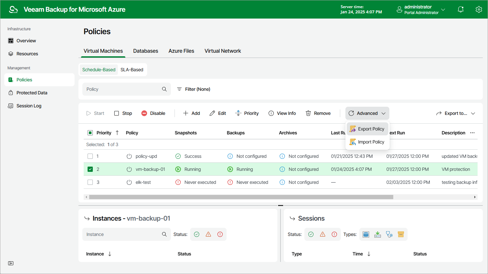
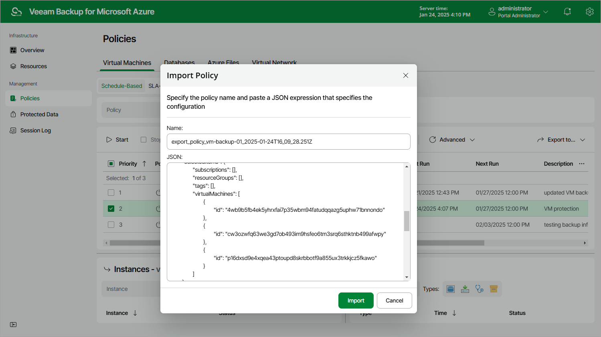

In this article

Veeam Backup for Microsoft Azure allows you to use settings of an existing schedule-based backup policy as a template for creating other policies. You can export a schedule-based backup policy to a .JSON file, modify the necessary settings in the file, and then import the policy to the same or a different backup appliance.

|  |
| --- |
| Important |
| In Veeam Backup for Microsoft Azure version 8.1, you cannot export or import SLA-based backup policies. |

Exporting Backup Policies

To export a schedule-based backup policy to a .JSON file, do the following:

1. Navigate to Policies.
2. Switch to the necessary tab and select the backup policy.
3. Click Advanced > Export Policy.

Veeam Backup for Microsoft Azure will save the schedule-based backup policy settings as a single .JSON file to the default download directory on the local machine.

Importing Backup Policies

To import a backup policy from a .JSON file, do the following:

1. Click Advanced > Import Policy.
2. In the Import Policy window, specify a name for the imported backup policy, paste the content of the necessary .JSON file, and click Import.

Page updated 3/24/2025

Page content applies to build 8.0.1.202
