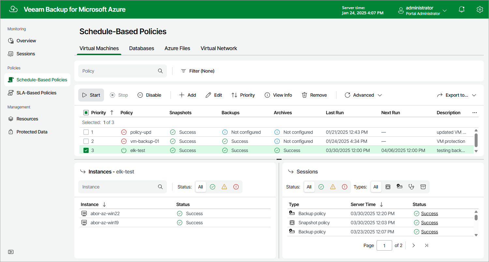

# Starting and Stopping Backup Policies

You can start a schedule-based backup policy manually, for example, if you want to create an additional restore point in the snapshot or backup chain and do not want to modify the configured policy schedule. You can also stop a schedule-based backup policy if processing of an Azure resource is about to take too long, and you do not want the policy to have an impact on the production environment during business hours.

|  |
| --- |
| Important |
| In Veeam Backup for Microsoft Azure version 8.1, you cannot start or stop SLA-based backup policies manually — as a workaround, you can [enable or disable the policy](backup_policy_enable_disable.md). |

To start or stop a schedule-based backup policy, do the following:

1. Navigate to Policies.
2. Switch to the necessary tab and select the backup policy.
3. Click Start or Stop.

