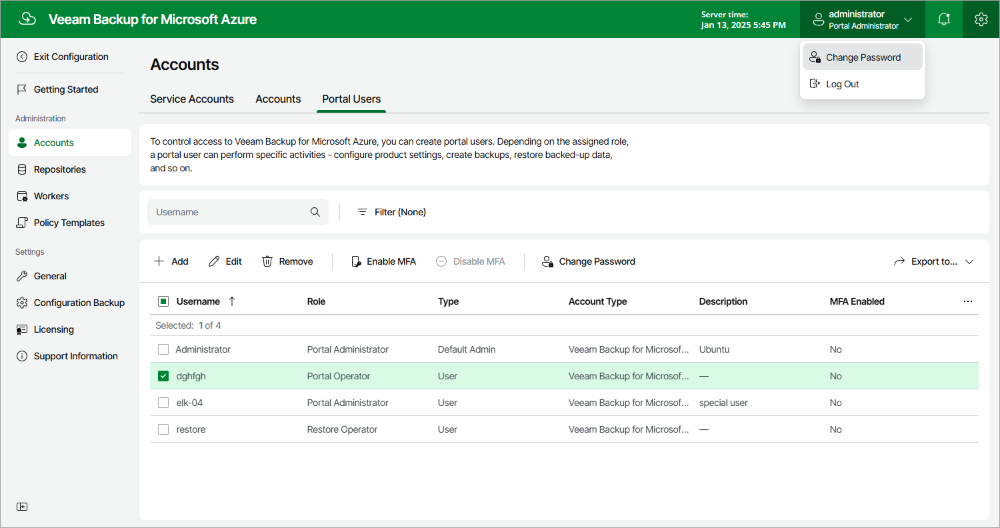

In this article

To change the password of the Default Admin account:

1. Log in to Veeam Backup for Microsoft Azure using credentials of the Default Admin account.
2. At the top right corner, click the user name and select Change Password.
3. In the Change Password window, enter the currently used password, enter and confirm a new password, and click OK.

Page updated 2/23/2024

Page content applies to build 8.0.1.202
