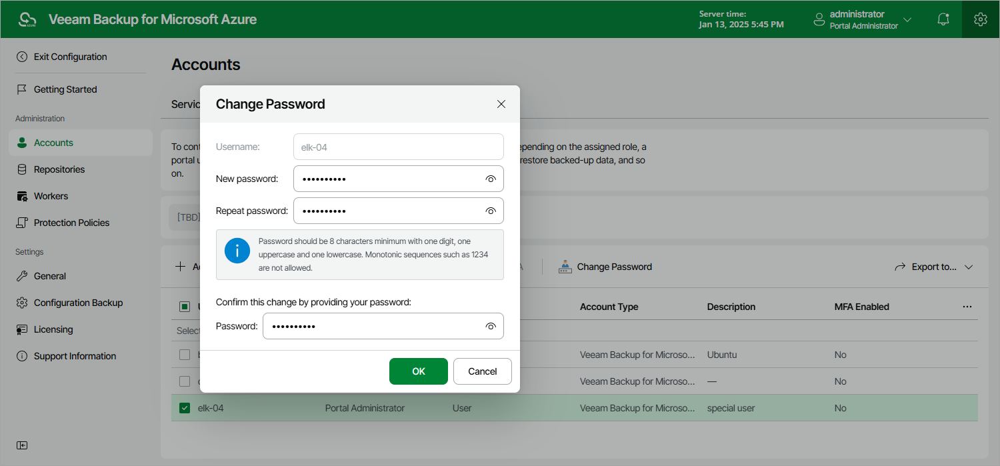

# Changing User Passwords

For Veeam Backup for Microsoft Azure user accounts, you can change the password specified while creating the account.

|  |
| --- |
| Note |
| Consider the following:   * Passwords of accounts whose user identities were obtained from an identity provider cannot be changed by any user accounts, including their own. These passwords can only be changed on the identity provider side. * If your backup appliance is managed by a Veeam Backup & Replication server and you change the password of a user whose credentials Veeam Backup & Replication uses to connect to the backup appliance, you must also change this user password in the Veeam Backup & Replication console as described in the Veeam Backup & Replication User Guide, section [Editing and Deleting Credentials Records](https://helpcenter.veeam.com/docs/vbr/userguide/credentials_edit_delete.html?ver=13). Otherwise, the connection will not be established. |

To change the password, do the following:

1. Switch to the Configuration page.
2. Navigate to Accounts > Portal Users.
3. Select the user account and click Change Password.
4. In the Change Password window, enter the currently used password, enter and confirm a new password, and then click OK.

|  |
| --- |
| Tip |
| You can change a password of a user that is currently logged in as described in section [Changing Default Admin Password](changing_default_admin_password.md). |

