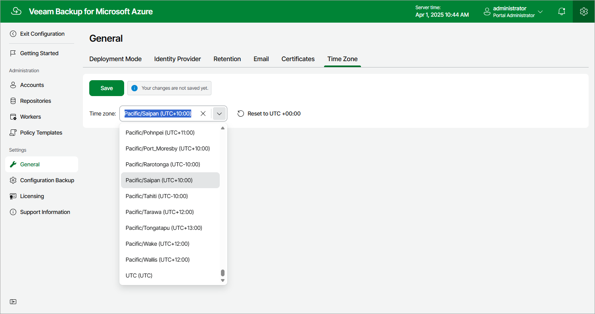

In this article

Veeam Backup for Microsoft Azure runs daily reports and performs all data protection and disaster recovery operations according to the time zone set on the backup appliance.

|  |
| --- |
| Important |
| If Daylight Saving Time (DST) is used in the time zone set on the backup appliance, consider the following:   * When DST starts (clocks are set one hour forward), all policy sessions scheduled to launch at the skipped hour on this day do not run. You can run the policies manually as described in section [Starting and Stopping Backup Policies](backup_policy_start_stop.md). * When DST ends (clocks are set one hour back), all policy sessions scheduled to launch at the duplicated hour on this day run only once. |

Since the backup appliance is deployed on an Azure VM in Microsoft Azure, the time zone is set to Coordinated Universal Time (UTC) by default. However, you can change the time zone if required. For example, you may want the time on the backup appliance to match the time on the workstation from which you access Veeam Backup for Microsoft Azure.

To change the time zone set on the backup appliance:

1. Switch to the Configuration page.
2. Navigate to General > Time Zone.
3. Select the necessary time zone from the Time zone drop-down list.
4. Click Save.

|  |
| --- |
| Note |
| It is not recommended that you change the time zone if any backup policy is currently running. Wait for all the running policies to complete or [stop them manually](backup_policy_start_stop.md) — and then try changing the time zone again. |

Page updated 1/4/2024

Page content applies to build 8.0.1.202
