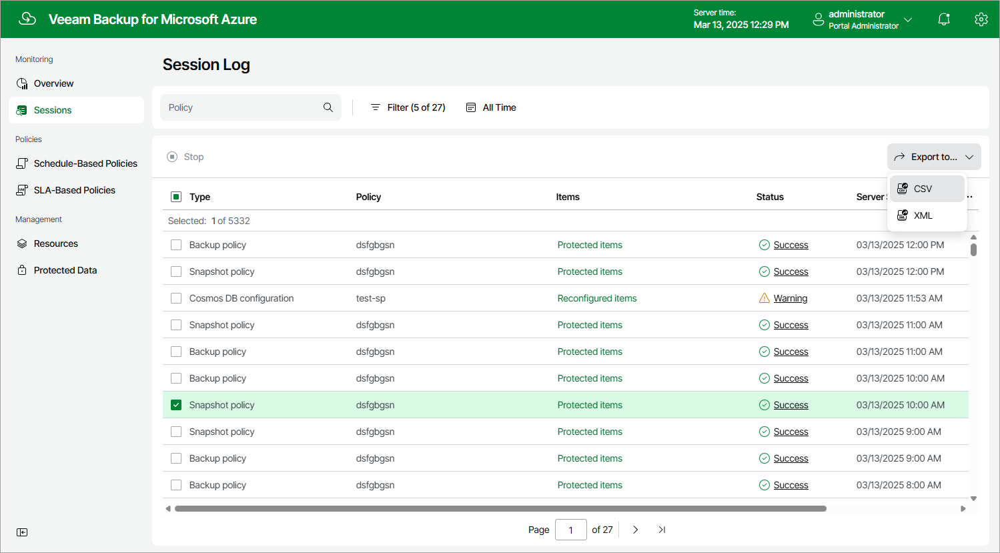

# Collecting Object Properties

You can export properties of objects managed by Veeam Backup for Microsoft Azure as a single file in the CSV or XML format. To do that, navigate to the necessary tab, select the objects whose properties you want to export and click Export to. Veeam Backup for Microsoft Azure will save the file with the exported data to the default download directory on the local machine.

|  |
| --- |
| Note |
| If you do not select any objects, Veeam Backup for Microsoft Azure will export properties of all objects available on the tab. |

