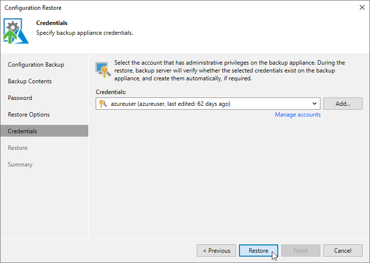

# Step 6. Specify User Credentials

[This step applies only if you have selected the Local users option at the Restore Options step of the wizard]

After the configuration restore process completes, Veeam Backup & Replication will try to connect to the backup appliance using credentials of the user specified [when adding the appliance](adding_appliance_console.md) to the backup infrastructure. However, since you have chosen to restore all users saved to the configuration backup file, this user may be overwritten and Veeam Backup & Replication will fail to connect to the appliance.

That is why at the Credentials step of the wizard, you will be prompted to specify a user whose credentials Veeam Backup & Replication will use to connect to the backup appliance. You can specify a new or an existing user. If you specify an existing user, the user must have been assigned the Portal Administrator role on the initial appliance and the credentials of the user must match the credentials saved in the configuration backup file.

For a user to be displayed in the Credentials list, it must be added to the Credentials Manager as described in the Veeam Backup & Replication User Guide, section [Standard Accounts](https://helpcenter.veeam.com/docs/vbr/userguide/credentials_manager_windows.html?ver=13). If you have not added the necessary user to the Credentials Manager beforehand, you can do it without closing the Configuration Restore wizard. To do that, click either the Manage accounts link or the Add button and specify the user name, password and description in the Credentials window.

|  |
| --- |
| Important |
| After you click Restore, the restore process will start. You will not be able to halt the process or edit the restore settings. |

