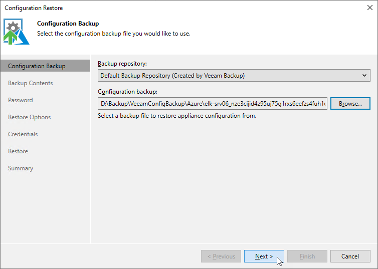

In this article

At the Configuration backup step of the wizard, do the following:

1. From the Backup Repository list, select a backup repository where the configuration backup file is stored.

For a repository to be displayed in the list of available repositories, it must be added to the backup infrastructure as described Veeam Backup & Replication User Guide, section [Adding Backup Repositories](https://helpcenter.veeam.com/docs/vbr/userguide/repo_add.html?ver=13).

1. Click Browse and select the necessary file.

|  |
| --- |
| Note |
| If the selected configuration backup file is not stored on the backup server, Veeam Backup & Replication will copy the file to a temporary folder on the server and automatically delete it from the folder as soon as the restore process completes. |

Page updated 8/20/2025

Page content applies to build 8.0.1.202
