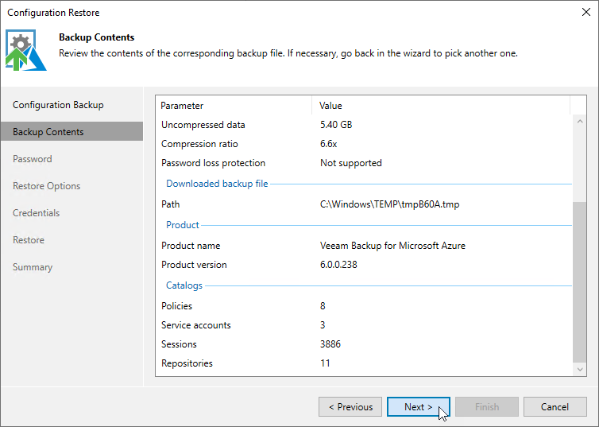

In this article

At the Backup Contents step of the wizard, Veeam Backup & Replication will analyze the content of the selected backup and display the following information:

* Backup file — the data and time when the backup file was created, the size of the file, the file location and so on.
* [Applies if the configuration backup file selected at [step 2](configuration_restore_console_file.md) is not stored on the backup server] Downloaded backup file — the temporary location of the configuration backup file on the backup server.
* Product — the name of the product and its version that was installed on the initial appliance.
* Catalogs — configuration data saved in the file (such as the number of configured backup policies, added user accounts, created repositories, logged session records an so on).

At the Backup Contents step of the wizard, review the provided information and click Next to confirm that you want to use the selected file to restore the configuration data.

Page updated 7/11/2025

Page content applies to build 8.0.1.202
