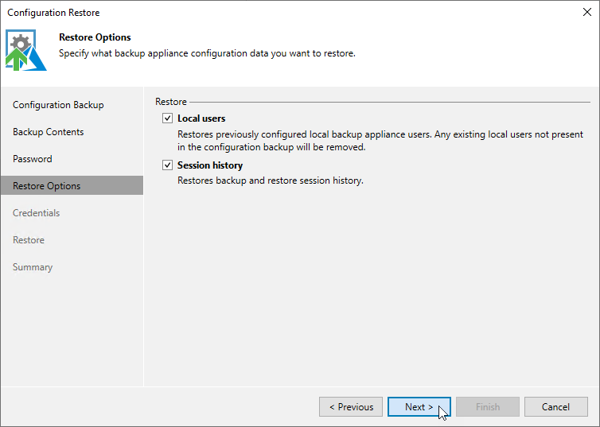

# Step 5. Choose Restore Options

By default, Veeam Backup & Replication restores configuration data for the existing infrastructure components, created backup policies, configured global settings.

At the Restore options step of the wizard, you can choose whether you want to restore session logs and portal users of the initial backup appliance as well.

If you select the Local users check box, Veeam Backup & Replication will restore all Portal Administrators, Portal Operators and Restore Operators saved to the configuration backup file — and overwrite the currently added portal users. If you select the Session history option, Veeam Backup & Replication will restore backup sessions, restore sessions, rescan sessions and service sessions — in this case, the restore process may take more to complete.

|  |
| --- |
| Important |
| After you click Next, the restore process will start. You will not be able to halt the process or edit the restore settings. |

