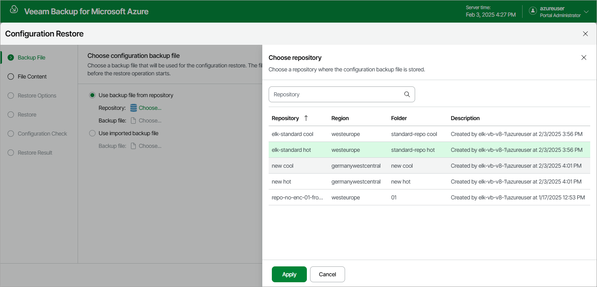

In this article

At the Backup File step of the wizard, choose whether you want to use an exported backup file or a backup file stored in a backup repository:

* If you want to use a file stored in a backup repository, select the Use backup file from repository option and do the following:

1. Click Choose in the Repository field, and use the list of available repositories in the Choose repository window to select the repository where the necessary configuration backup file is stored.

For a backup repository to be displayed in the Repository list, it must be added to Veeam Backup for Microsoft Azure as described in section [Adding Backup Repositories](repository_add_ui.md). The list shows only backup repositories that have encryption enabled and immutability disabled.

1. Click Choose in the Backup file field, and select the necessary file in the Choose backup file window.

* If you want to use a file that was exported from this or another backup appliance, select the Use imported backup file option and do the following:

1. Click Choose in the Backup file field.
2. In the Import backup file window, browse to the necessary backup file, provide the password that was used to encrypt the file, and click Import.

|  |
| --- |
| Important |
| The size of an uploaded backup file must not exceed 10 GB. To upload a file of a bigger size, open a [support case](support_information.md). |

Page updated 2/5/2024

Page content applies to build 8.0.1.202
