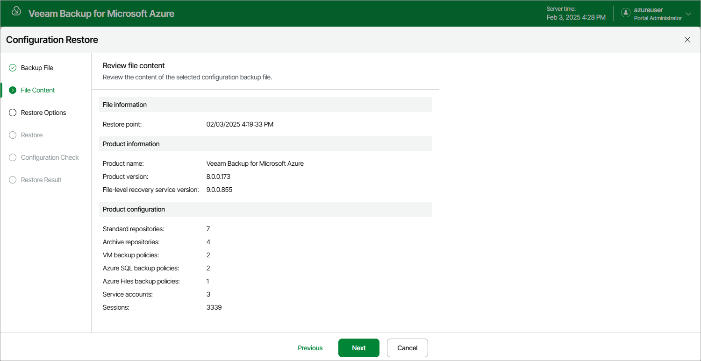

In this article

Veeam Backup for Microsoft Azure will analyze the content of the selected backup file and display the following information:

* File information — the date and time when the backup file was created.
* Product information — the version of Veeam Backup for Microsoft Azure that was installed on the initial backup appliance and the version of the File-level recovery service that was running on the appliance.

|  |
| --- |
| Important |
| Consider that if the current version of Veeam Backup for Microsoft Azure installed on the backup appliance is later than the version saved in the configuration backup file, the configuration restore operation will not downgrade the backup appliance version. |

* Product configuration — configuration data saved in the file (such as the number of configured backup policies, added user accounts, created backup repositories, logged session records and so on).

At the File Content step of the wizard, review the provided information and click Next to confirm that you want to use the selected file to restore the configuration data.

Page updated 2/3/2025

Page content applies to build 8.0.1.202
