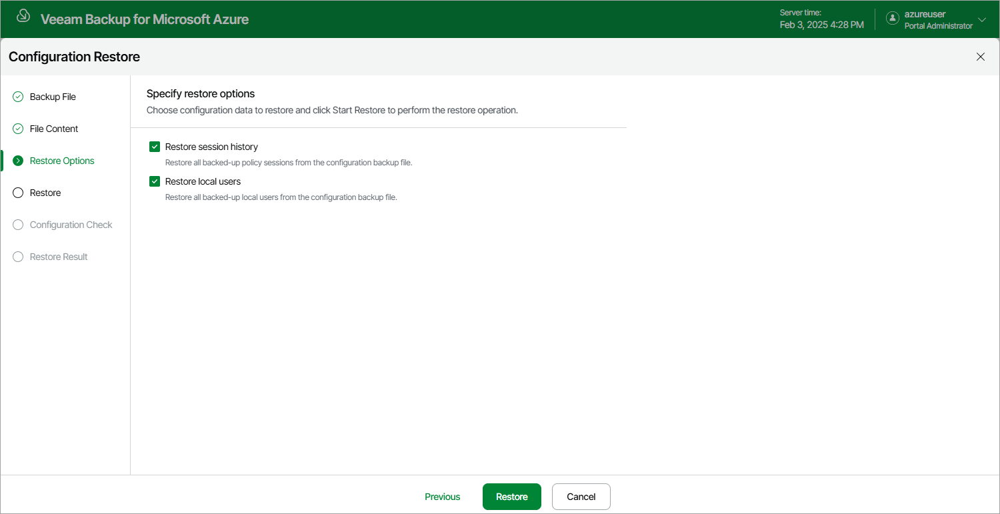

In this article

By default, Veeam Backup for Microsoft Azure restores only configuration data for the existing architecture components, created backup policies and configured global settings. At the Restore Options step of the wizard, you can choose whether you want to restore session logs and user accounts of the initial backup appliance as well.

|  |
| --- |
| Important |
| After you click Restore, the restore process will start. You will not be able to halt the process or edit the restore settings. |

Page updated 2/5/2024

Page content applies to build 8.0.1.202
