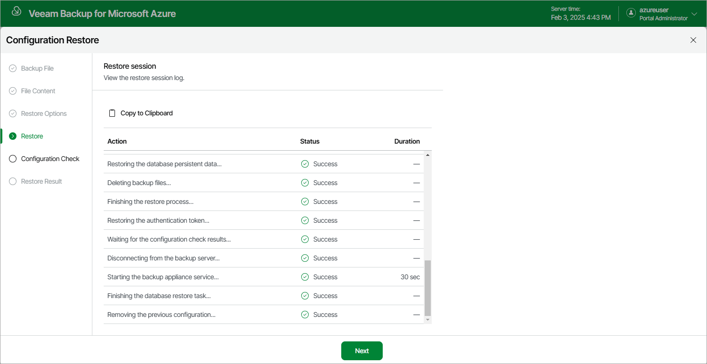

In this article

Veeam Backup for Microsoft Azure will display the results of every step performed while executing the configuration restore. At the Restore step of the wizard, wait for the restore process to complete and click Next.

Page updated 2/5/2024

Page content applies to build 8.0.1.202
