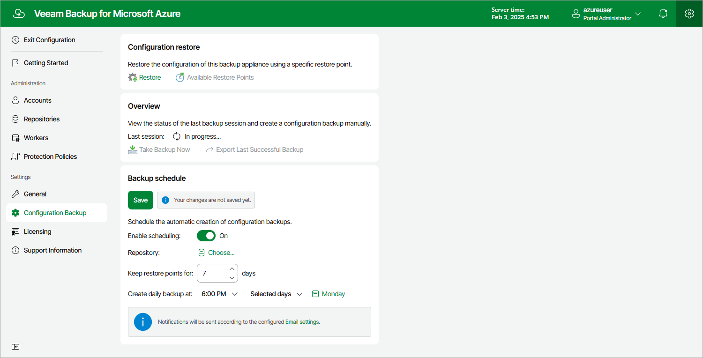

In this article

[Starting from version 6.0, this functionality has been deprecated and is available only for upgraded appliances that previously had the feature enabled]

You can instruct Veeam Backup for Microsoft Azure to automatically create snapshots of the backup appliance. You can then use these snapshots to restore the entire backup appliance to another Azure VM.

To configure the auto-backup settings, do the following:

1. Switch to the Configuration page.
2. Navigate to Configuration Backup.
3. Switch to the Snapshot-Based tab.
4. Set the Enable snapshot backup toggle to On.
5. In the Configure the snapshot settings and schedule section, do the following:

1. In the Restore points to keep field, specify the number of snapshots that you want to keep in the snapshot chain.

If the snapshot limit is exceeded, Veeam Backup for Microsoft Azure removes the earliest snapshot from the chain. For more information, see sections [VM Snapshot Retention](vm_snapshot_retention.md) and [File Share Snapshot Retention](file_share_snapshot_retention.md).

1. In the Schedule section, choose whether you want to create snapshots daily, monthly or periodically:

* Select the Daily at this time option if you want Veeam Backup for Microsoft Azure to create snapshots once a day on defined days. You can choose whether snapshots will be created every day, on weekdays (Monday through Friday) or on specific days.

* Select the Monthly at this time option if you want Veeam Backup for Microsoft Azure to create snapshots once a month on a defined day.
* Select the Periodically every option if you want Veeam Backup for Microsoft Azure to create snapshots repeatedly throughout a day with a specific time interval. You can choose whether snapshots must be created every several hours or minutes. You can also instruct Veeam Backup for Microsoft Azure to create snapshots continuously, one after another.

|  |
| --- |
| Tip |
| If you choose to create snapshots once every several hours, you can also delay the snapshot creation by a defined amount of time within the specified interval. To do that, click Schedule and set the delay value (in minutes) in the Start time within an hour field. |

1. Click Save.

Page updated 7/1/2024

Page content applies to build 8.0.1.202
