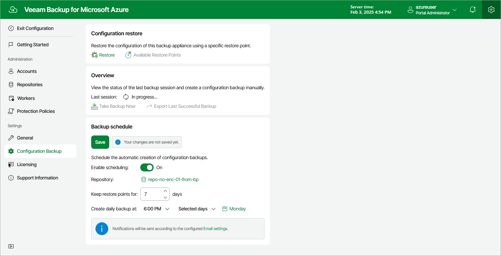

# Performing Scheduled Configuration Backup

While performing configuration backup, Veeam Backup for Microsoft Azure exports data from the configuration database and saves it to a backup file in a backup repository. To instruct Veeam Backup for Microsoft Azure to back up the configuration database of the backup appliance automatically by schedule, do the following:

1. Switch to the Configuration page.
2. Navigate to Configuration Backup.
3. In the Backup schedule section, set the Enable scheduling toggle to On.
4. Click Choose in the Repository field, and use the list of available repositories in the Choose Repository window to select a backup repository where configuration backups will be stored.

For a backup repository to be displayed in the list of available repositories, it must be added to Veeam Backup for Microsoft Azure as described in section [Adding Backup Repositories](repository_add_ui.md). The list shows only backup repositories that have encryption enabled and immutability disabled.

1. In the Keep restore points for field, specify the number of days for which you want to keep restore points in a backup chain in the selected backup repository.

If a restore point is older than the specified time limit, Veeam Backup for Microsoft Azure removes the restore point from the chain. For more information, see [VM Backup Retention](vm_backup_retention.md), [SQL Backup Retention](sql_backup_retention.md) and [Cosmos DB Backup Retention](cosmos_db_backup_retention.md) .

1. In the Create daily backup at field, choose whether configuration backups will be created every day, on weekdays (Monday through Friday), or on specific days.
2. Click Save.

