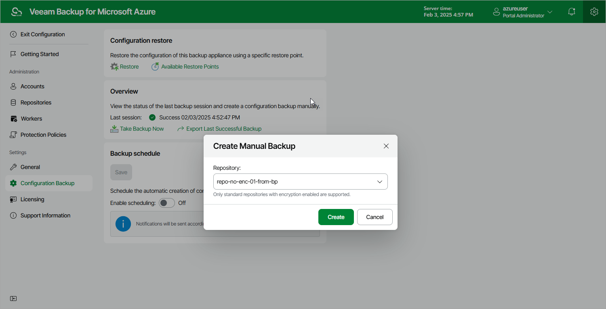

# Performing Manual Configuration Backup

While performing configuration backup, Veeam Backup for Microsoft Azure exports data from the configuration database and saves it to a backup file in a repository. To back up the configuration database of the backup appliance manually, do the following:

1. Switch to the Configuration page.
2. Navigate to Configuration Backup.
3. In the Overview section, click Take Backup Now.
4. In the Create Manual Backup window, select a backup repository where the configuration backup will be stored, and click Create.

For a backup repository to be displayed in the Repository list, it must be added to Veeam Backup for Microsoft Azure as described in section [Adding Backup Repositories](repository_add_ui.md). The Repository list shows only backup repositories that have encryption enabled and immutability disabled.

As soon as you click Create, Veeam Backup for Microsoft Azure will start creating a new backup in the selected repository. To track the progress, click Go to Sessions in the Session Info window to proceed to the [Session Log page](session_statistics.md).

