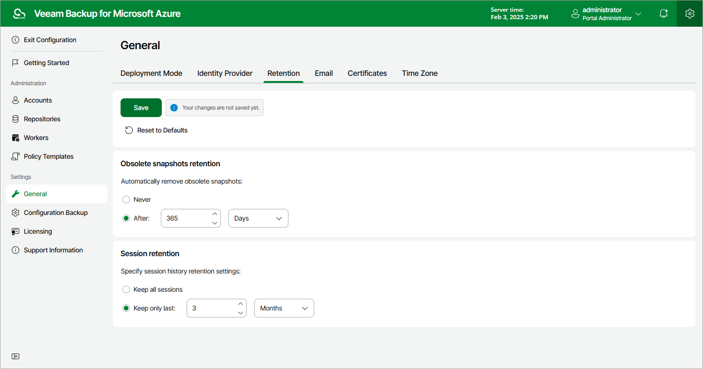

# Configuring Global Retention Settings

You can configure global retention settings to specify for how long the following data will be retained by Veeam Backup for Microsoft Azure:

* [Obsolete snapshots](#snapshots)
* [Session records](#sessions)

Configuring Retention Settings for Obsolete Snapshots

When you create a backup policy, you can configure a retention period for snapshots that will be created by this policy. However, in some cases you may need to set a specific time limit that will apply to all backup policies in order to save space in backup repositories. To do that, you can configure global snapshot retention settings to instruct Veeam Backup for Microsoft Azure to remove all obsolete snapshots from both the configuration database and Microsoft Azure Storage.

|  |
| --- |
| Notes |
| * Obsolete snapshot retention settings apply to all cloud-native snapshots of Azure VMs and file shares, regardless of the solution that was used to create these snapshots.  * Veeam Backup for Microsoft Azure prioritizes global retention settings over retention settings configured for backup policies. If snapshots produced by a backup policy are older than the global retention period, these snapshots will be removed anyway. |

To configure global retention settings for obsolete snapshots, do the following:

1. Switch to the Configuration page.

1. Navigate to General > Retention.

1. In the Obsolete snapshots retention section, select the After option and specify the number of days, months or years during which Veeam Backup for Microsoft Azure will keep obsolete snapshots in the configuration database and Microsoft Azure Storage.

The number must be between 15 and 36135 for days, between 1 and 1188 for months and between 1 and 99 for years.

1. Click Save.

|  |
| --- |
| Tip |
| Use the Never option if you do not want Veeam Backup for Microsoft Azure to apply any global retention settings to obsolete snapshots. In this case, Veeam Backup for Microsoft Azure will remove obsolete snapshots according to retention settings configured for backup policies. |

Configuring Retention Settings for Session Records

Veeam Backup for Microsoft Azure stores records for the login activity and all sessions of performed data protection and disaster recovery operations in the configuration database on the additional data disk attached to the backup appliance. The default retention period for the login activity records equals 3 months and cannot be modified. The session records are removed from the configuration database according to specific retention settings.

To configure retention settings for session records, do the following:

1. In the Session retention section, select either of the following options:

* Select the Keep all sessions option if you do not want Veeam Backup for Microsoft Azure to remove session records.
* Select the Keep only last option if you want to specify the number of days, months or years during which Veeam Backup for Microsoft Azure will keep session records in the configuration database.

If you select this option, Veeam Backup for Microsoft Azure will remove all session records that are older than the specified time limit.

1. Click Save.

|  |
| --- |
| Important |
| Retaining all session records in the configuration database may overload the data disk. By default, the disk comes with 32 GB of storage capacity. If you choose not to remove sessions records at all, consider increasing the disk space to avoid runtime problems. |

